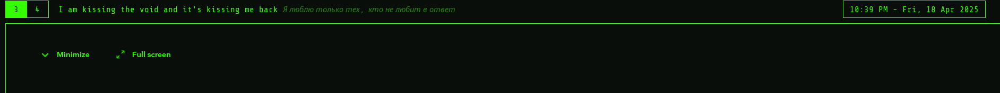

# B.A.R.D - Ballad Assistant Rhythm Debugger

A Rust based lyrics display for music player to show synchronized lyrics.



## Features

- Displays lyrics in a terminal window
- Displays current lyrics in [Waybar](https://github.com/Alexays/Waybar) based on song position
- Reads lyrics from music file tags
- Fetches lyrics from online sources if not found in file tags
- Saves lyrics to file for future use
- Supports multiple music players
- Supports timestamped lyrics for precise synchronization
- Automatically scrolls lyrics based on current position in song
- Tries to guess song artist and title from file name and path
- Runs in continuous mode to keep lyrics updated

## Requirements

- playerctl
- music player daemon
- Rust (for building)

## Optionals

- Waybar

## Run on terminal

Just run `bard`

## Run with Waybar

Add the following to your Waybar configuration file (typically `~/.config/waybar/config`):

```
 "custom/lyrics": {
    "exec": "waybar-bard",
    "format": "{} <span font='11' fgalpha='50%' style='italic'>{alt}</span>",
    "restart-interval": 5,
    "return-type": "json",
    "signal": 1,  // SIGRTMIN+1
    "tooltip": true
}
```

Then add styling in your Waybar CSS file:

```
#custom-lyrics {
    padding: 0 10px;
    color: #ffffff;
}

#custom-lyrics.no-song {
    color: #888888;
}

#custom-lyrics.no-lyrics {
    color: #aaaaaa;
    font-style: italic;
}

#custom-lyrics.has-lyrics {
    color: #ffffff;
}
```

## Installing

Clone this repository:

```
git clone https://github.com/puszkarek/bard
```

Install the program:

```
cd bard && sudo make install
```

## Timestamped Lyrics Format

For best synchronization, use lyrics with timestamps in the format:

```
[MM:SS.CC] Lyrics line
```

Example:

```
[00:12.34] This is the first line
[00:15.67] This is the second line
```

## Configuration

The application uses a JSON configuration file located at `~/.config/bard/config.json`. The file is automatically created with default values on first run.

### Configuration File Location

The config file is stored at:

```
~/.config/bard/config.json
```

### Configuration Options

The configuration file contains the following options:

| Option          | Description                             | Default    |
| --------------- | --------------------------------------- | ---------- |
| `tidal`         | Tidal authentication configuration      | Optional   |
| `lyrics_folder` | Directory where lyrics files are stored | `~/lyrics` |
| `colors`        | Terminal UI color configuration         | See below  |

#### Tidal Configuration (Optional)

The `tidal` section contains the following options:

| Option          | Description                  | Default                            |
| --------------- | ---------------------------- | ---------------------------------- |
| `access_token`  | Your Tidal API access token  | Empty string (must be set by user) |
| `refresh_token` | Your Tidal API refresh token | Empty string (must be set by user) |

#### Color Configuration

The `colors` section contains the following options:

| Option       | Description                                      | Default   |
| ------------ | ------------------------------------------------ | --------- |
| `default_fg` | Default text color for non-focused elements      | `"gray"`  |
| `focused_fg` | Text color for currently active/focused elements | `"white"` |

### Example Configuration

```json
{
  "tidal": {
    "access_token": "your-tidal-access-token-here",
    "refresh_token": "your-tidal-refresh-token-here"
  },
  "lyrics_folder": "/home/user/lyrics",
  "colors": {
    "default_fg": "gray",
    "focused_fg": "white"
  }
}
```

**Note:** The `tidal` section is optional. If you don't want to use Tidal lyrics, you can omit it entirely.

## Supported Online Sources

#### Tidal

To get your Tidal API tokens:

1. Log in to Tidal in your browser and open the developer console
2. Go to the Network tab
3. Search for "tidal" or "auth.tidal.com"
4. Find a request to `https://auth.tidal.com/v1/oauth2/token` that contains both `access_token` and `refresh_token`
5. Copy both tokens and paste them into the config file at `~/.config/bard/config.json`

**Note:** The application will automatically refresh your access token using the refresh token when needed, so you don't need to manually update the access token.

#### TODO: Spotify

## License

MIT

### Roadmap

- [ ] Add loading indicator when fetching lyrics
